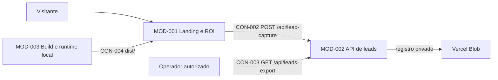

# ARCHITECTURE — Observall Site

> Planta técnica deste repositório. Documento exclusivamente AS-IS, derivado do código real.

**Fonte:** análise direta do código  
**Data da análise:** 2026-07-17  
**Horizonte:** AS-IS  
**Status:** DERIVADA_DO_CODIGO  
**Decisões relacionadas:** ADR-001, ADR-002, ADR-003
**Specs relacionadas:** SPEC-001, SPEC-002

## 1. Stack real

| Camada | Tecnologia | Versão/fonte |
|---|---|---|
| Runtime de desenvolvimento/build | Node.js | v22.22.3 observado localmente |
| Interface | HTML5, CSS3 e JavaScript de browser | arquivos raiz, sem framework |
| API serverless | Funções JavaScript compatíveis com Vercel | `api/*.js` |
| Persistência de leads | Vercel Blob privado | `@vercel/blob` 2.6.1 |
| Testes | Node.js Test Runner | `node --test` |
| Build | Script Node.js próprio | `scripts/build.mjs` |

**Não existem no projeto:** framework SPA/SSR, banco relacional, ORM, autenticação de visitantes, CMS, worker ou fila.

## 2. Visão geral e fluxo de referência



**Fluxo de referência — calculadora de ROI:**

1. `index.html` declara a narrativa do Score da Loja, campos, modal de lead e regiões de resultado.
2. `script.js` valida a entrada, calcula o cenário, exige o lead e envia `CON-002`.
3. `api/lead-capture.js` valida novamente os campos, normaliza o registro e persiste no Blob privado.
4. `test/site.test.mjs` prova contrato editorial, comportamento calculável, API local e integridade de assets.
5. `scripts/build.mjs` copia a landing e `public/` para `dist/`.

## 3. Modelo de domínio

| Entidade | Papel | Relações | Particularidades |
|---|---|---|---|
| Simulação de ROI | Cenário financeiro ilustrativo informado pelo visitante | acompanha um lead | números em BRL e percentuais; não é promessa comercial |
| Lead | Contato comercial que desbloqueia o resultado | possui uma simulação | nome, empresa, WhatsApp e e-mail obrigatórios |
| Registro de lead | Envelope persistido pela API | contém lead, simulação e metadados mínimos | ID UUID, data ISO, hash de IP e user-agent limitado |

## 4. Estrutura Real De Pastas

```text
api/                 funções de captura e exportação de leads
public/assets/       imagens e logos próprios consumidos pela landing
scripts/             build estático e servidor local
test/                testes de contrato e integração leve
dist/                artefato gerado; não é fonte de edição
index.html            estrutura e conteúdo da landing
styles.css            apresentação e responsividade
script.js             interações, carrossel e ROI
video.js              reprodução do vídeo institucional
```

## 5. Contratos De API

| ID | Contrato | Método/auth | Consumidores |
|---|---|---|---|
| CON-001 | IDs, classes e atributos DOM usados por CSS/JS | N/A | `styles.css`, `script.js`, `video.js`, testes |
| CON-002 | `/api/lead-capture` | POST, público, validação server-side | calculadora de ROI |
| CON-003 | `/api/leads-export` | GET, token `ROI_LEADS_TOKEN` | operador autorizado |
| CON-004 | `dist/` com HTML, CSS, JS, vídeo e assets | build local | hospedagem estática/Vercel |

`CON-002` responde `200`, `400`, `405` ou `422`. `CON-003` responde HTML, CSV ou JSON e bloqueia acesso sem token.

## 6. Autenticação e autorização

- A landing é pública e não mantém sessão.
- A captura de lead é pública, limitada por tamanho e validação de campos.
- A exportação exige segredo server-side `ROI_LEADS_TOKEN`; o segredo não pertence ao frontend.
- O Blob usa acesso privado.

## 7. Regras de camada

| Regra | Gate |
|---|---|
| `index.html` preserva `CON-001` quando CSS/JS dependem dele | `npm.cmd test` |
| Cálculo e UX ficam em `script.js`; persistência e segredos ficam em `api/` | revisão + `npm.cmd test` |
| `dist/` é sempre regenerado, nunca editado como fonte | `npm.cmd run build` |
| Todo asset referenciado deve existir em `public/assets/` | teste “todas as imagens referenciadas” |

## 8. Gerenciamento de estado

| Tipo | Onde vive |
|---|---|
| Inicial/editorial | HTML |
| UI local | DOM e variáveis de `script.js` |
| Persistente | registros privados no Vercel Blob |
| Sessão/global | não existe |

## 9. Requisitos mínimos de plataforma

- Browser moderno em desktop, tablet e celular; viewport mínimo contratado: 360 px.
- Idioma: português do Brasil.
- Tema: claro com seções escuras; sem alternador.
- Acessibilidade: HTML semântico, foco visível, link de salto, texto alternativo e `prefers-reduced-motion`.
- Offline: não suportado.

## 10. Escalabilidade e cache

- Frontend estático e cacheável; APIs são serverless e `no-store`.
- Não há fila, paginação pública ou concorrência crítica nesta landing.
- A exportação pagina internamente a listagem do Blob em lotes de até 1.000.
- Capturas recebem UUID, mas não há deduplicação comercial entre reenvios.

## 11. Gaps e pontos de atenção

| Gap | Severidade | Ação/dono |
|---|---|---|
| `PROJECT.md` ainda descreve HostGator e “sem backend”, divergindo do código Vercel | MÉDIA | sincronizar neste ciclo / @DOC |
| Não há teste automatizado de rate limit/deduplicação da captura | BAIXA para esta mudança editorial | avaliar em spec própria / @B/@S |
| Publicação e variáveis Vercel não são demonstradas nesta rodada | MÉDIA operacional | exige @CRED e autorização explícita |

## 12. Catálogo modular observado

| ID | Módulo real | Responsabilidade | API pública | Dados/owner | Invariantes | Dono |
|---|---|---|---|---|---|---|
| MOD-001 | Landing e ROI | Conteúdo, navegação, interação e simulação | CON-001, CON-002 | estado efêmero no browser | INV-001, INV-002 | frontend |
| MOD-002 | API de leads | Validar, persistir e exportar leads | CON-002, CON-003 | registros privados de lead | INV-003 | backend serverless |
| MOD-003 | Build e runtime local | Gerar `dist/` e servir smoke local | CON-004 | artefatos gerados | INV-004 | tooling |

**Invariantes:**

- INV-001: todo asset da landing resolve localmente.
- INV-002: o resultado completo do ROI só é apresentado após validação da simulação e do lead.
- INV-003: a exportação nunca libera dados sem `ROI_LEADS_TOKEN` válido.
- INV-004: `dist/` é reproduzível a partir das fontes versionadas.

### Dependências observadas

| Origem | Destino | Tipo | Evidência | Estado |
|---|---|---|---|---|
| MOD-001 | MOD-002 | HTTP síncrona | `script.js:persistLead` | PERMITIDA |
| MOD-003 | MOD-001 | build | `scripts/build.mjs:root` | PERMITIDA |
| MOD-002 | Vercel Blob | SDK | `api/lead-capture.js:put` | PERMITIDA |

**Ciclos observados:** nenhum.

## 13. Transacoes, Consistencia E Eventos Observados

| Fluxo | Limite | Consistência | Efeito | Idempotência/retry | Evidência |
|---|---|---|---|---|---|
| Capturar lead | MOD-002 | eventual no Blob | grava um JSON privado | UUID por envio; fallback temporário sem retry | `api/lead-capture.js` |
| Exportar leads | MOD-002 | leitura paginada | HTML/CSV/JSON | operação somente leitura | `api/leads-export.js` |

## 14. Patterns observados

Não há `PATTERN_MAP.md` normativo. A separação landing/API e o build estático são observados, mas não são promovidos a novos patterns nesta mudança editorial. Gate de drift: `python RUNTIME_Bridge/scripts/validate_architecture.py ..` e `npm.cmd run check`.
